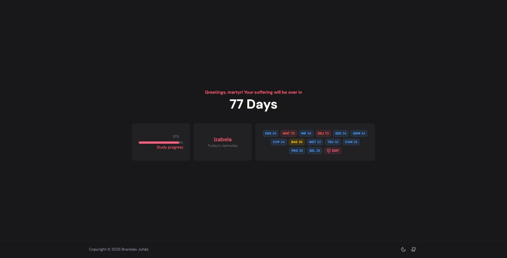

# DN Goodbye




## Description

DN Goodbye is an academic days counter and classes counter for the rest of the school year at BG MH.  
It shows how many school days and specific subject classes remain, along with helpful announcements for upcoming important dates.

## Setup

### 1. Install dependencies

```bash
pnpm install
```

### 2. Run the app
```bash
pnpm dev
```
then open http://localhost:3000 in your browser.

### 3. Build for production
```bash
pnpm build
pnpm preview
```

## Deployment

This project is designed to be deployed to Vercel. Every push to `main` branch will automatically trigger a new deployment.
## Contributing

Contributions are welcome.

- **Issues**: Use GitHub Issues to report bugs or suggest features. Please include clear steps to reproduce and relevant context.
- **Pull requests**:
  - Fork the repository and create a feature branch.
  - Make your changes with clear, small commits.
  - Ensure the app builds and runs locally:
    ```bash
    pnpm install
    pnpm build
    ```
  - Open a pull request with a short description of the change and any relevant screenshots.

## License

This project is licensed under the **MIT License**.

See the full license text in [`LICENSE`](./LICENSE).

---

Member of DN Family | Dedicated to Ema Donátová